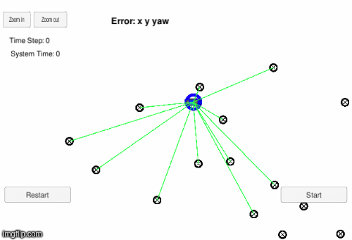

# Particle Filter 

This project contains the skeleton [code](https://github.com/udacity/CarND-Kidnapped-Vehicle-Project) 
for the Localization course in Udacity's Self-Driving Car Nanodegree.

<a href="https://www.youtube.com/watch?v=qKuo6CHQeHk" target="_blank">
</a>

## Project Introduction
A robot has been kidnapped and transported to a new location! Luckily it has a 
map of this location, a (noisy) GPS estimate of its initial location, and lots 
of (noisy) sensor and control data.

In this project a two-dimensional particle filter is implemented in C++. The 
particle filter will be given a map and some initial localization information 
(analogous to what a GPS would provide). At each time step your filter will also
 get observation and control data.

## Running the Code
This project involves the Term 2 Simulator which can be downloaded 
[here](https://github.com/udacity/self-driving-car-sim/releases)

This repository includes two files that can be used to set up and install 
uWebSocketIO for either Linux or Mac systems. For windows you can use either 
Docker, VMware, or even Windows 10 Bash on Ubuntu to install uWebSocketIO.

Once the install for uWebSocketIO is complete, the main program can be built 
and ran by doing the following from the project top directory.

```
mkdir build && cd build
cmake .. && make
./particle_filter
```

Alternatively some scripts have been included to streamline this process, 
these can be leveraged by executing the following in the top directory of the project:

```
./clean.sh
./build.sh
./run.sh
```

# Structure

```
.particle_filters           # project root
|   build.sh
|   clean.sh
|   CMakeLists.txt
|   README.md
|   run.sh
|
|___data                    # map data input to the filter
|   |   map_data.txt
|___src
    |   helper_functions.h
    |   main.cpp
    |   map.h
    |   particle_filter.cpp
    |   particle_filter.h
```

`map_data.txt` has three columns [x, y, landmark_id].